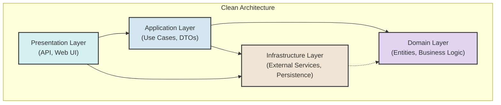
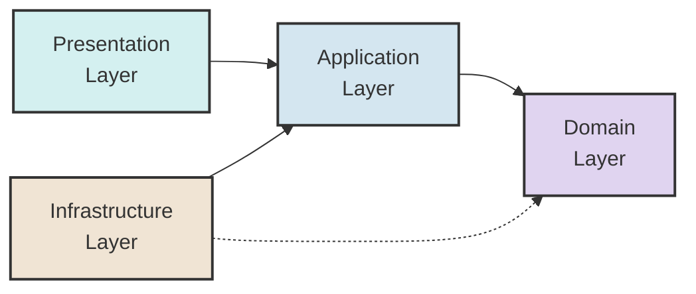
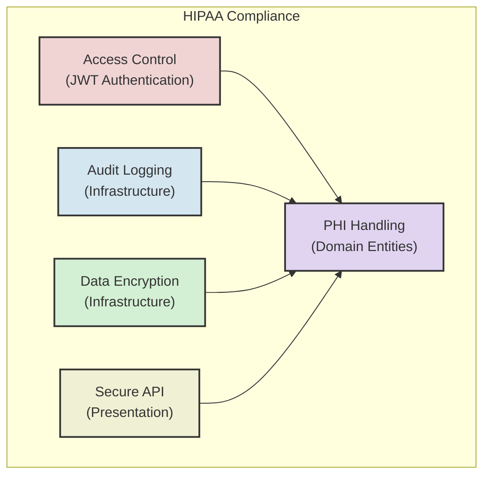
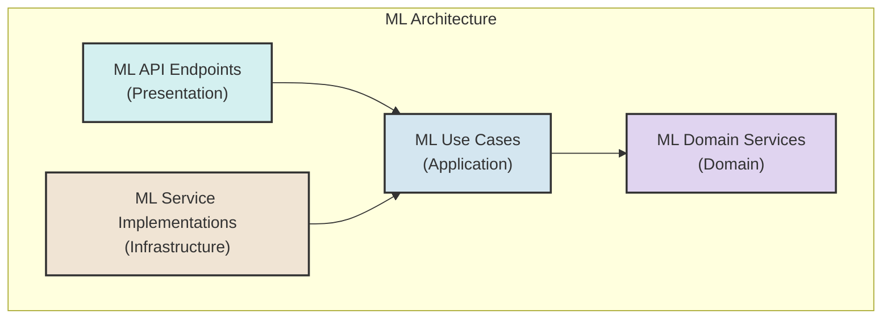

# Clean Architecture Diagram

The Clarity-AI Backend implements Clean Architecture, which separates concerns into concentric layers. Each layer has a specific responsibility and dependency flows only inward.

## Layer Responsibilities

### Domain Layer (Core)

The innermost layer contains:

- **Entities**: Business objects with methods and properties
- **Value Objects**: Immutable objects defined by their attributes
- **Domain Services**: Domain logic that doesn't belong to a specific entity
- **Domain Interfaces**: Abstractions required by domain logic
- **Domain Events**: Events representing state changes in domain objects

### Application Layer

The application layer contains:

- **Use Cases**: Application-specific business rules
- **DTOs**: Data Transfer Objects for input/output
- **Application Services**: Orchestration of domain objects
- **Application Interfaces**: Abstractions for external dependencies

### Infrastructure Layer

The infrastructure layer contains:

- **Repositories**: Data access implementations
- **External Services**: Integration with external systems
- **ORM Mappings**: Database mappings
- **Authentication**: Security implementations
- **Logging**: Logging implementations
- **Cache**: Caching implementations

### Presentation Layer

The presentation layer contains:

- **API Controllers/Endpoints**: HTTP request handlers
- **API Models**: Request/response models
- **Middleware**: HTTP pipeline components
- **Validation**: Input validation
- **Documentation**: API documentation

## Dependency Flow

The dependency rule states that source code dependencies should only point inward. This means:

- Domain layer has no dependencies on other layers
- Application layer depends only on the domain layer
- Presentation layer depends on application and domain layers
- Infrastructure layer depends on application and domain layers

## HIPAA Compliance Considerations

HIPAA compliance is integrated across all layers:

- **Domain Layer**: Defines PHI entities and security rules
- **Application Layer**: Enforces business rules for PHI access
- **Infrastructure Layer**: Implements encryption, audit logging
- **Presentation Layer**: Secure API endpoints, authentication

## Machine Learning Integration

Machine learning components follow the same architectural principles:

- **Domain Layer**: ML core entities and service interfaces
- **Application Layer**: ML use cases and orchestration
- **Infrastructure Layer**: Specific ML model implementations
- **Presentation Layer**: ML-related API endpoints